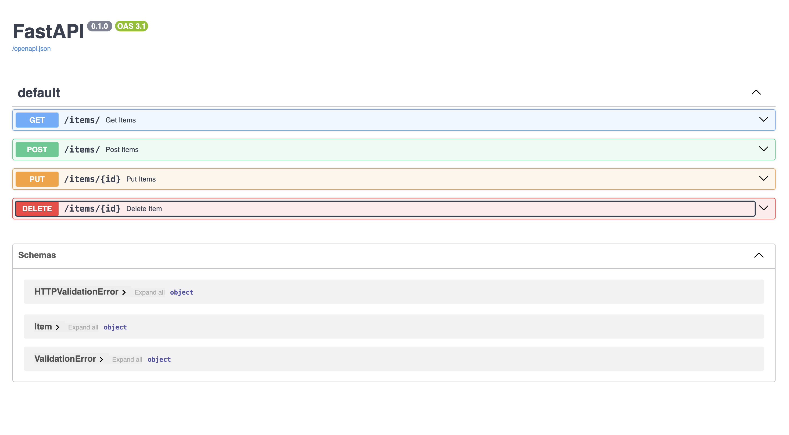
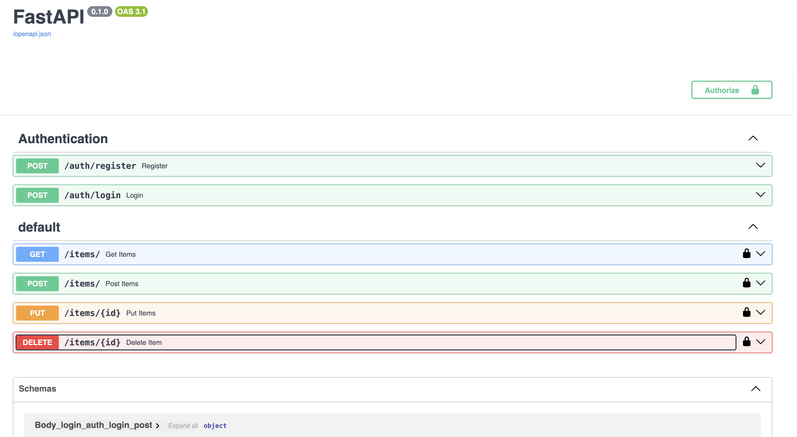

# 1. Virtual Env Set Up
`python3 -m venv myenv`

Mac: `source myenv/bin/activate`
On Windows : `myenv\Scripts\activate`

TO Deactivate : deactivate

Save packages into a file : `pip freeze > requirements.txt`


# 2. Install dependencies
1. Install FastAPI and Uvicorn :
```
pip3 install fastapi uvicorn
pip3 install sqlalchemy
pip install bcrypt "python-jose[cryptography]"
```

# 3. Run your FastAPI app:
`uvicorn main:app --reload`


# 4. Docs
1. Swagger Docs
Swagger UI:
http://127.0.0.1:8000/docs


2. Alternative (ReDoc UI):
http://127.0.0.1:8000/redoc

# 5. Basic User Authentication Overview

Users must sign up and log in before accessing `/items` routes.

We’ll use:  
- User table for storing usernames & hashed passwords  
- bcrypt for password hashing  
- JWT for authentication  
- OAuth2PasswordBearer from FastAPI for securing endpoints  

## 6. File Structure Additions

- `schemas.py` → Request/response models for users  
- `utils.py` → Password hashing & JWT helper functions  
- `auth.py` → Routes for login & registration  

## 7. Steps to Test Authentication

### Register User
**POST** `/auth/register`  

```
{
  "username": "testuser",
  "password": "1234"
}
```
**Login** User
POST /auth/login
```
{
  "username": "testuser",
  "password": "1234"
}
```
You’ll receive an access_token.

If using swagger for testing
1. Click the Authorize button in Swagger (top-right) (or)
2. Through Postman add Bearer TOken in Headers
```
Paste Bearer <token>:
Bearer eyJhbGciOi...
```
Now you can call /items/ endpoints successfully.

# 8. Images
## CRUD API Image

## Authorization 

